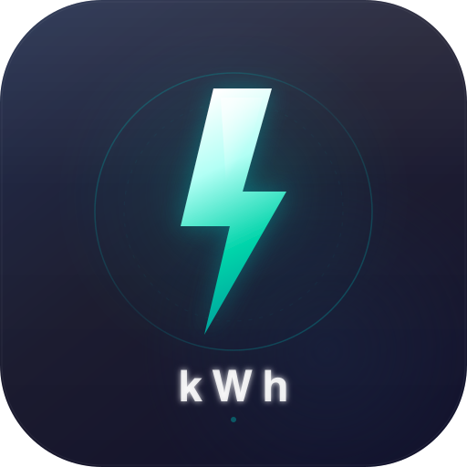

<p align="center">
  
</p>

<h1 align="center">EV kWh Reimbursement App</h1>

<p align="center">
  Calculate, track, and export electric vehicle charging reimbursements.
</p>

<p align="center">
  
  
  
  
  
</p>

---

## Overview

A client-side Progressive Web App for Siemens employees to calculate EV charging reimbursements from daily kWh usage data. The application runs entirely in the browser with no backend — all data is stored in `localStorage`.

**Problem**: Employees who charge company EVs at home need to calculate reimbursement amounts from utility billing data and submit expense reports with supporting documentation.

**Solution**: Enter billing period dates and daily kWh readings (manually or via CSV), configure your utility rate (flat or tiered), and generate export-ready PDFs, Excel spreadsheets, and Siemens-formatted receipts.

**Users**: Siemens employees, field technicians, fleet managers, and anyone tracking EV charging costs for reimbursement.

---

## Core Features

| Feature | Description |
|---|---|
| **Multi-Profile Management** | Separate data stores for different vehicles or billing accounts |
| **Flexible Rate Configuration** | Flat rate, two-tier cumulative billing, saved rate presets, additional named charges |
| **CSV Import/Export** | Template download, validated import with error highlighting, XSS-safe parsing |
| **Three Export Formats** | Excel (SheetJS), PDF report (jsPDF), Siemens-branded receipt with receipt number |
| **Billing History** | Archive periods, restore past data, delete records, per-entry PDF export |
| **Interactive Charts** | Dual-axis kWh + cost chart, month-over-month trend comparison |
| **EV Impact Stats** | CO₂ saved vs gasoline, miles powered, tree-month equivalents |
| **Stats for Nerds** | Total days tracked, avg daily usage, cost per mile, data points, build info |
| **Guided Tour** | 9-step spotlight walkthrough for first-time users with keyboard navigation |
| **Theme Switcher** | System / Light / Dark tri-state pill with OS preference detection |
| **PWA** | Installable, offline-capable, silent auto-updates with service worker |
| **Dashboard Summary** | Real-time stat chips for total kWh, cost, daily average, data completeness |

---

## Technology Stack

| Layer | Technology | Purpose |
|---|---|---|
| **Markup** | HTML5 | Semantic structure, native `<details>` collapsibles |
| **Styling** | CSS3 Custom Properties | Design token system, light/dark theming |
| **Logic** | JavaScript ES Modules | 18 modules, no transpilation, native `import/export` |
| **UI Framework** | Bootstrap 5.3.0 | Grid, modals, tooltips, form controls |
| **Icons** | Bootstrap Icons 1.10.5 | UI iconography |
| **Charts** | Chart.js (latest) | Dual-axis line/bar charts |
| **Excel Export** | SheetJS 0.18.5 | XLSX generation with currency formatting |
| **PDF Export** | jsPDF 2.5.1 + AutoTable 3.7.0 | Report and receipt PDF generation |
| **Hosting** | GitHub Pages | Static file serving, no server required |
| **Storage** | localStorage | Profile-scoped client-side persistence |

All external libraries loaded via CDN with SRI integrity hashes. No `package.json`, no build step, no bundler.

---

## Architecture

```
┌─────────────────────────────────────────────────────┐
│                    index.html                        │
│              (single-page application)               │
├─────────────────────────────────────────────────────┤
│  app.js (entry point + event delegation)             │
│    ├── storage.js ──── localStorage (profile-scoped) │
│    ├── profiles.js                                   │
│    ├── billing.js ──── tiered rates + cost engine     │
│    ├── fields.js ───── kWh input generation           │
│    ├── csv.js ──────── import/export with validation  │
│    ├── chart.js ────── Chart.js dual-axis             │
│    ├── summary.js ──── dashboard stat chips           │
│    ├── history.js ──── archive management             │
│    ├── presets.js ──── rate preset CRUD               │
│    ├── trend.js ────── month-over-month chart         │
│    ├── stats.js ────── EV impact + nerds stats        │
│    ├── tour.js ─────── guided walkthrough             │
│    ├── feedback.js ─── star rating + mailto           │
│    ├── ui.js ───────── theme switcher + helpers       │
│    ├── exports/
│    │   ├── excel.js ── SheetJS XLSX                   │
│    │   ├── pdf.js ──── jsPDF report                   │
│    │   └── receipt.js ─ Siemens receipt               │
│    └── utils/
│        └── dates.js ── timezone-safe date parsing     │
├─────────────────────────────────────────────────────┤
│  sw.js (service worker: cache-first app shell,       │
│         network-first CDN, offline fallback)          │
└─────────────────────────────────────────────────────┘
```

### Key Patterns

- **Event delegation**: A single `click` listener on `document` dispatches via `data-action` attributes — no inline `onclick` handlers
- **Cross-module callbacks**: `setOnFieldsGenerated()`, `setOnHistoryChange()`, etc. for loose coupling between modules
- **Profile-scoped storage**: All `getItem`/`setItem` calls auto-prefix with `ProfileName__` — theme and tour state are intentionally global
- **Data-driven billing**: `computeCostsFromData()` is a pure function for history/receipts; `computeTieredDailyCostsMap()` reads the DOM for the active session
- **Timezone-safe dates**: `parseLocalDate()` uses `new Date(y, m-1, d)` to avoid UTC midnight offset bugs from `new Date("YYYY-MM-DD")`

---

## Project Structure

```
EV-Reimbursement-App/
├── index.html              Single-page app, CSP header, CDN links, all modals
├── manifest.json           PWA manifest (name, icons, theme, display mode)
├── sw.js                   Service worker (cache strategy, app shell, CDN caching)
├── CLAUDE.md               AI assistant project conventions
│
├── css/
│   ├── variables.css       Design tokens: colors, spacing, typography, radii, transitions
│   ├── base.css            Reset, header, footer, body layout, theme switcher, skip link
│   ├── components.css      Cards, buttons, profile bar, stats, history, collapsibles
│   ├── animations.css      Keyframes: fade, slide, highlight, spin, pulse
│   ├── responsive.css      Breakpoints: 768px, 600px, 360px
│   └── tour.css            Spotlight overlay and tooltip positioning
│
├── js/
│   ├── app.js              Entry point: imports, DOMContentLoaded, event delegation
│   ├── storage.js          Profile-scoped localStorage wrapper + migration
│   ├── profiles.js         Profile CRUD and dropdown UI
│   ├── billing.js          Tiered rate engine, cost computation, additional charges
│   ├── fields.js           Daily kWh field generation and validation
│   ├── csv.js              CSV template download, import with XSS-safe parsing
│   ├── chart.js            Chart.js dual-axis line chart (kWh + cost)
│   ├── summary.js          Dashboard stat chips and progress bar
│   ├── history.js          Billing period archive, restore, delete, PDF export
│   ├── presets.js           Rate preset CRUD and dropdown
│   ├── trend.js            Month-over-month bar + line comparison chart
│   ├── stats.js            EV Impact (CO₂, miles) + Stats for Nerds
│   ├── tour.js             9-step guided tour with spotlight overlay
│   ├── feedback.js         Star rating form and mailto generation
│   ├── ui.js               Theme switcher (system/light/dark), button states, tooltips
│   ├── exports/
│   │   ├── excel.js        SheetJS XLSX with currency formatting
│   │   ├── pdf.js          jsPDF + AutoTable report PDF
│   │   └── receipt.js      Siemens-branded receipt PDF
│   └── utils/
│       └── dates.js        parseLocalDate, ymd, forEachDay, dayCount, isValidDateRange
│
└── icons/
    ├── icon.svg            App icon (SVG source)
    ├── icon-192.png        PWA icon 192×192
    ├── icon-512.png        PWA icon 512×512 (also maskable)
    ├── apple-touch-icon.png  iOS home screen icon 180×180
    ├── favicon-32x32.png   Browser tab favicon
    ├── og-image.svg        Open Graph image (SVG source)
    └── og-image.png        Open Graph image 1200×630
```

---

## Installation

### Prerequisites

- A modern browser (Chrome 80+, Firefox 78+, Safari 14+, Edge 80+)
- An HTTP server (ES modules do not work over `file://` URLs)
- Internet connection on first load (CDN libraries are then cached by the service worker)

### Setup

```bash
git clone https://github.com/calebohara/EV-Reimbursement-App.git
cd EV-Reimbursement-App
```

There is no `npm install` or build step. The app is ready to serve.

---

## Running the Application

### Development

```bash
# Option 1: Python
python3 -m http.server 8080

# Option 2: Node.js (npx)
npx serve -l 8080 .
```

Open `http://localhost:8080` in your browser.

### Production

Push to GitHub and enable GitHub Pages on the `main` branch. No build step required — the repository is the deployment artifact.

### Direct Download

1. Download the repository as a ZIP from GitHub
2. Extract to any directory
3. Serve with any static HTTP server

---

## Configuration

No environment variables or configuration files are required. All settings are managed through the UI and persisted in `localStorage`.

### localStorage Keys

| Key | Scope | Purpose |
|---|---|---|
| `profiles` | Global | JSON array of profile names |
| `currentProfile` | Global | Active profile name |
| `themeMode` | Global | `'system'` \| `'light'` \| `'dark'` |
| `tourCompleted` | Global | Boolean flag for guided tour |
| `ratePresets` | Global | JSON array of saved rate configurations |
| `{Profile}__startDate` | Profile | Billing period start |
| `{Profile}__endDate` | Profile | Billing period end |
| `{Profile}__costPerKwh` | Profile | Rate per kWh |
| `{Profile}__history` | Profile | JSON array of archived billing periods |
| `{Profile}__dailyKwh_*` | Profile | Per-day kWh values |

---

## PWA Functionality

### Installation

- **Desktop Chrome/Edge**: Click the install icon in the address bar
- **Android**: "Add to Home Screen" from the browser menu or the in-app install banner
- **iOS Safari**: Share → "Add to Home Screen" (guided by an in-app overlay)

### Offline Behavior

The service worker (`sw.js`) uses a two-tier caching strategy:

| Resource Type | Strategy | Behavior |
|---|---|---|
| App shell (HTML, CSS, JS, icons) | Cache-first | Serve from cache, fall back to network |
| CDN libraries (Bootstrap, Chart.js, etc.) | Network-first | Fetch fresh, cache response, fall back to cache |
| Other requests | Network with cache fallback | Standard fetch with offline resilience |

On activation, stale caches are automatically purged. The app calls `skipWaiting()` and `clients.claim()` for immediate updates.

### Manifest

```
Display:     standalone
Orientation: portrait-primary
Theme:       #1a1a2e (dark navy)
Icons:       192px, 512px (PNG), any (SVG), 512px maskable
```

---

## Accessibility

The application targets WCAG 2.1 AA compliance:

| Practice | Implementation |
|---|---|
| **Skip navigation** | `<a href="#main-content" class="skip-link">` hidden until focused |
| **Landmarks** | `<header>`, `<main id="main-content">`, `<footer>` |
| **Language** | `lang="en"` on `<html>` |
| **Focus indicators** | `:focus-visible` outlines on all interactive elements |
| **ARIA roles** | `role="radiogroup"` on theme switcher, `role="figure"` on stat cards, `role="group"` on related controls |
| **ARIA states** | `aria-checked` on theme buttons, `aria-expanded` on toggles, `aria-live="polite"` on dynamic regions |
| **Labels** | `aria-label` on all buttons, inputs, and icon-only controls |
| **Keyboard navigation** | Tour: Escape/ArrowRight/ArrowLeft/Enter. Star rating: Enter/Space. All modals: standard Bootstrap keyboard trapping |
| **Color contrast** | WCAG AA (4.5:1) verified for all text tokens in both themes |
| **Semantic HTML** | Native `<details>/<summary>` for collapsibles, `<button>` for actions, `<input>` for data entry |

---

## Performance

| Technique | Detail |
|---|---|
| **Zero build** | No transpilation, bundling, or minification overhead — files served as-is |
| **Service worker caching** | Full app shell cached on install; subsequent loads served from cache |
| **CDN with SRI** | Libraries loaded from global CDNs with subresource integrity verification |
| **Progressive disclosure** | Sections hidden until data exists — reduces initial DOM and paint |
| **Staggered animations** | kWh field rows animate with capped `transition-delay` (max 0.33s) |
| **Chart lazy rendering** | Charts render only when data is present |
| **Cache busting** | Versioned query strings (`?v=3`) on icons and CSS files |

---

## Security

| Measure | Implementation |
|---|---|
| **Content Security Policy** | `<meta>` CSP restricting script, style, font, image, and connect sources |
| **Subresource Integrity** | SHA-384 hashes on all 7 CDN resources with `crossorigin="anonymous"` |
| **XSS prevention** | All user data rendered via `createElement` + `.textContent` — never `innerHTML` with untrusted data |
| **Input sanitization** | `escapeHTML()` helper for CSV import and history label rendering |
| **Resilient storage** | All `JSON.parse` calls wrapped in try-catch with safe defaults |
| **No server communication** | `connect-src 'self'` — data never leaves the browser |
| **No credentials stored** | No passwords, tokens, or API keys |

---

## CSV Format

The CSV template is auto-generated with dates from your selected billing period.

```csv
Date,kWh Usage
2026-03-01,10.5
2026-03-02,12.0
2026-03-03,8.7
```

**Validation rules**:
- Header row must be `Date,kWh Usage`
- Dates in `YYYY-MM-DD` format
- Dates must fall within the selected billing period
- kWh values must be non-negative numbers
- Empty rows are skipped

---

## Development Guidelines

### Code Standards

- **Pure ES modules** — `import`/`export` with no build tools
- **Safe DOM APIs** — use `createElement` + `.textContent` for user data; never `innerHTML` with dynamic content
- **Event delegation** — add `data-action="your-action"` to elements and handle in `app.js` switch block
- **Profile-scoped storage** — use `storage.getItem()`/`storage.setItem()` which auto-prefix with the active profile name
- **CSS custom properties** — use design tokens from `variables.css` (e.g., `var(--siemens-teal)`, `var(--border-color)`)

### Adding a New Module

1. Create `js/your-module.js` with exported functions
2. Import in `js/app.js`
3. Wire up in `DOMContentLoaded` and/or event delegation switch
4. Add the file to `sw.js` `APP_SHELL_RELATIVE` array
5. Bump the SW `CACHE_NAME` version

### Version Checklist

When releasing a new version, update all of these:

| Location | What to update |
|---|---|
| `js/stats.js` | `APP_VERSION` constant |
| `js/feedback.js` | `APP_VERSION` constant |
| `js/exports/receipt.js` | Footer version string |
| `index.html` | Footer `<span>v{x.y.z}</span>` |
| `index.html` | Changelog modal entry |
| `sw.js` | `CACHE_NAME` version |
| `README.md` | Version badge + changelog |

---

## Version History

### v3.7.2 — March 2026
Bug fix release. 11 issues resolved from first QA sweep (S1).
- **Critical**: kWh summary chip now sourced from billing module (`summary.js`) — display guaranteed to match dollar calculation
- **High**: SW `CACHE_NAME` corrected from `v3.12.3` to `v3.7.2`; star rating arrow-key navigation added (WCAG 2.1 SC 2.1.1); `storage.js` null guard in `getStorageUsage()`
- **Medium**: Receipt footer version fixed (`v3.7` → `v3.7.2`); `aria-pressed` on star rating; PDF effective rate type unified with Excel (`''` for zero-kWh rows); history sort no longer mutates storage array; `resultBox` null guard in `app.js`; `setTheme()` input validation in `ui.js`
- Added `QC.md` (quality control checklist + 5-agent sweep prompt) and `BUGS.md` (issue tracker)

### v3.7.1 — March 2026
Guided tour expansion, ADA compliance improvements, security hardening, and legal disclaimer modal.

---

## Roadmap

- [ ] Multi-currency support for international Siemens offices
- [ ] Time-of-use rate schedules (peak / off-peak / super off-peak)
- [ ] Data export/import for cross-device transfer
- [ ] Utility API integration for automatic kWh retrieval
- [ ] Team dashboard for fleet managers
- [ ] Localization (i18n) for non-English users

---

## License

This project is proprietary and confidential. All rights reserved.

---

## Disclaimer

This application was independently developed by [Caleb O'Hara](https://www.calebblaze.com) as a personal productivity tool. It is not an official Siemens product, nor is it endorsed, sponsored, maintained, or affiliated with Siemens AG or any of its subsidiaries. "Siemens" is a registered trademark of Siemens AG.

---

## Acknowledgements

- [Bootstrap](https://getbootstrap.com/) — UI framework and component library
- [Bootstrap Icons](https://icons.getbootstrap.com/) — Icon set
- [Chart.js](https://www.chartjs.org/) — Interactive charting
- [SheetJS](https://sheetjs.com/) — Excel file generation
- [jsPDF](https://github.com/parallax/jsPDF) — PDF document generation
- [jsPDF-AutoTable](https://github.com/simonbengtsson/jsPDF-AutoTable) — PDF table formatting

---

<p align="center">
  <sub>Built by <a href="https://www.calebblaze.com">Caleb O'Hara</a></sub>
</p>
